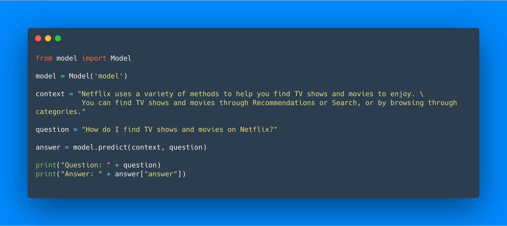

# DistilBERT-SQuAD

# WIP 🚧 - I will be deploying it with Flask soon!

# The Stanford Question Answering Dataset (SQuAD)

Stanford Question Answering Dataset (SQuAD) is a reading comprehension dataset, consisting of questions posed by crowdworkers on a set of Wikipedia articles, where the answer to every question is a segment of text, or span, from the corresponding reading passage, or the question might be unanswerable.

https://rajpurkar.github.io/SQuAD-explorer/

# What is DistilBERT?

Thanks to the brilliant people at [Hugging Face](https://huggingface.co/) we now have DistilBERT, which stands for Distilated-BERT. DistilBERT is a small, fast, cheap and light Transformer model based on Bert architecture. It has 40% less parameters than `bert-base-uncased`, runs 60% faster while preserving 97% of BERT's performance as measured on the GLUE language understanding benchmark. DistilBERT is trained using knowledge distillation, a technique to compress a large model called the teacher into a smaller model called the student. By distillating Bert, we obtain a smaller Transformer model that bears a lot of similarities with the original BERT model while being lighter, smaller and faster to run. DistilBERT is thus an interesting option to put large-scaled trained Transformer model into production. [Transformers - Hugging Face repository](https://github.com/huggingface/transformers)

Victor Sahn of Hugging Face [wrote a great Medium post](https://medium.com/huggingface/distilbert-8cf3380435b5) introducing DistilBERT and explaining parts of their newly released [NeurIPS 2019 Workshop paper](https://arxiv.org/abs/1910.01108)

# Installation

If you are testing this on your own machine I would recommend you do the setup in a virtual environment, as not to affect the rest of your files. 

In Python3 you can set up a virtual environment with `python3 -m venv /path/to/new/virtual/environment`. Or by installing virtualenv with pip by doing `pip3 install virtualenv`, creating the environment with `virtualenv venv`, and finally activating it with `source venv/bin/activate`

You must have Python3

Install the requirements with:

`pip3 install -r requirements.txt`

### SQuAD Fine-tuned model 

The SQuAD fine-tuned model is available in my [S3 Bucket](https://distilbert-finetuned-model.s3.eu-west-2.amazonaws.com/pytorch_model.bin) or alternatively inside the model.py file you can specify the type of model you wish to use, the one I have provided, or a Hugging Face fine-tuned SQuAD model

`distilbert-base-uncased-distilled-squad`. 

You can do this with 

`model = DistilBertForQuestionAnswering.from_pretrained('distilbert-base-uncased-distilled-squad', config=config)`

# Making predictions

